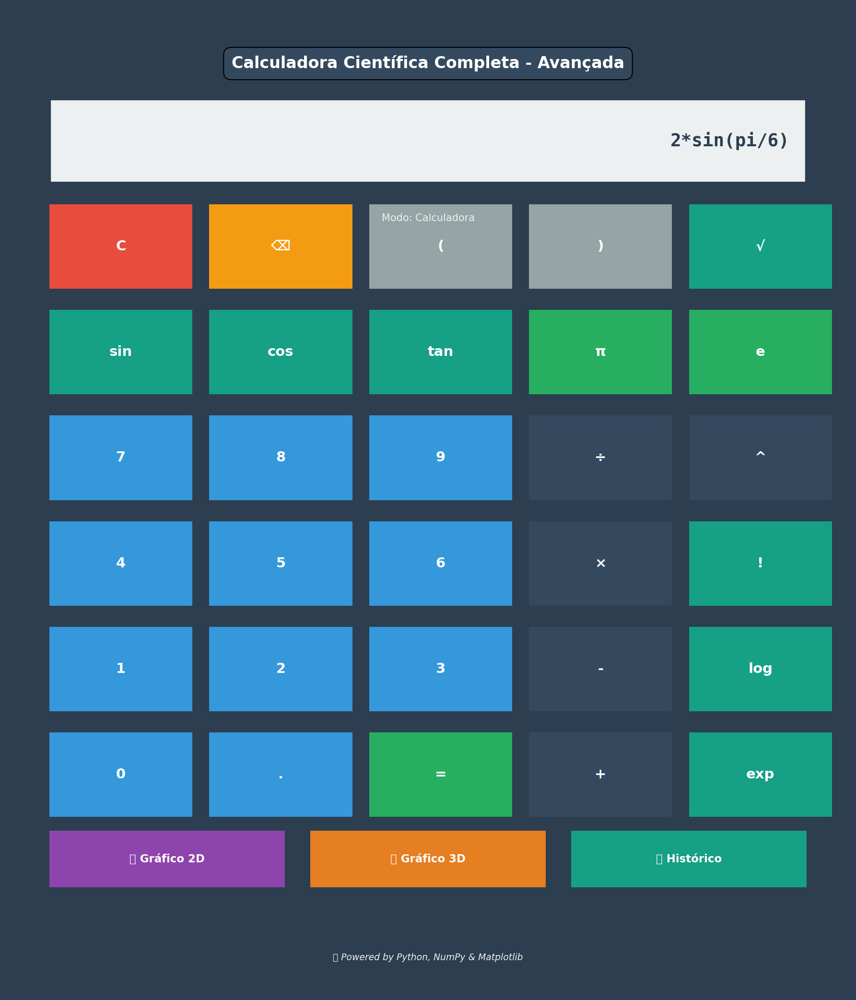
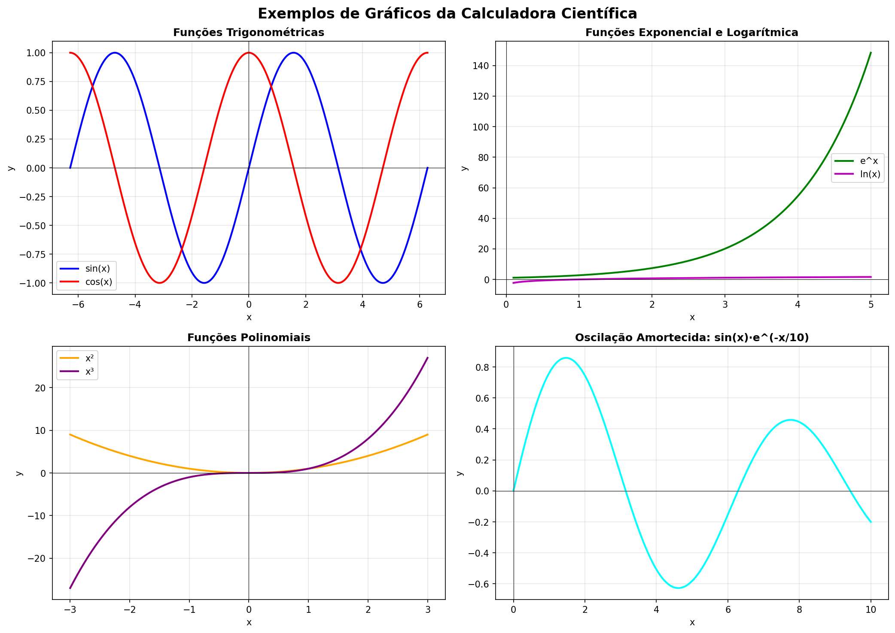
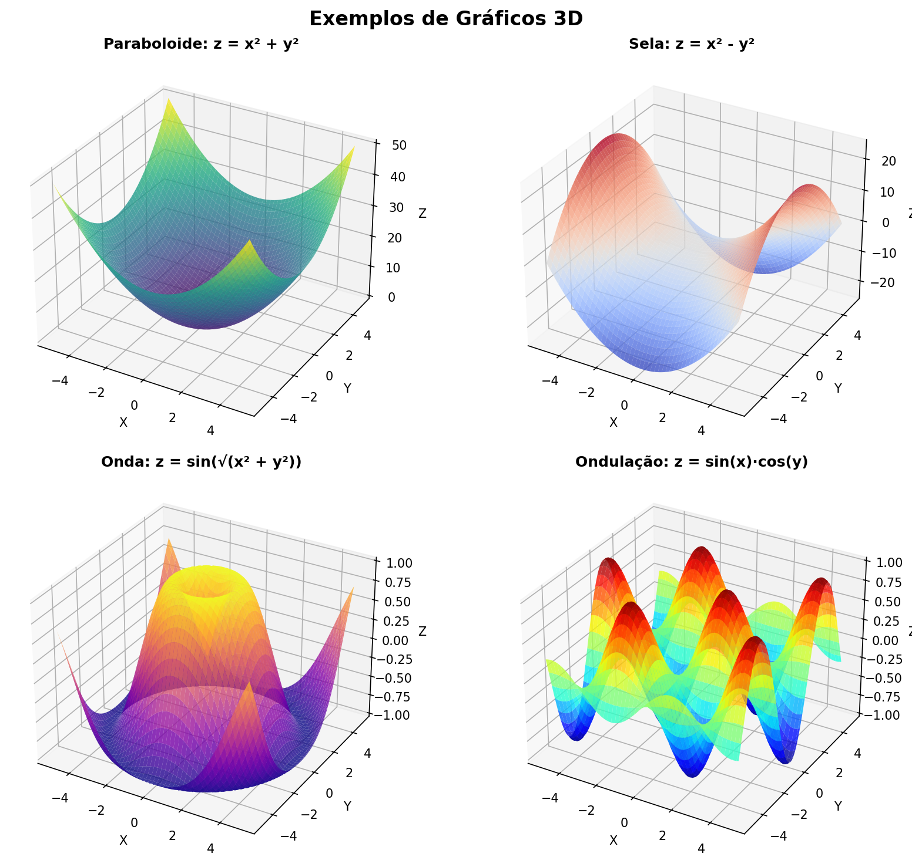

# 🧮 Scientific Calculator - Calculadora Científica Completa


Uma calculadora científica completa desenvolvida em Python com interface gráfica moderna e capacidades avançadas de visualização de gráficos.

## ⚠️ Nota de Segurança

**IMPORTANTE**: Esta calculadora usa `eval()` para avaliar expressões matemáticas, o que pode representar riscos de segurança se usado com entrada não confiável. 

**Recomendações**:
- Use apenas para fins educacionais e pessoais
- Não exponha esta aplicação diretamente na internet sem proteções adequadas
- Digite apenas expressões matemáticas válidas
- Não execute código de fontes não confiáveis

Para uso em produção, considere usar bibliotecas de parsing mais seguras como `sympy.sympify()` ou `ast.literal_eval()` com parsers customizados.

## ✨ Características

### 🔢 Operações Matemáticas
- **Básicas**: Soma, subtração, multiplicação, divisão
- **Avançadas**: Potenciação, raiz quadrada, raiz n-ésima
- **Trigonométricas**: Seno, cosseno, tangente (em graus)
- **Logaritmos**: Base 10, base natural (ln), base customizada
- **Outras**: Fatorial, exponencial, valor absoluto, módulo

### 📊 Visualizações Gráficas
- **Gráficos 2D**: Plotagem de funções matemáticas com zoom e pan
- **Gráficos 3D**: Superfícies tridimensionais interativas
- **Gráficos Polares**: Coordenadas polares para funções circulares
- **Múltiplas Funções**: Compare várias funções no mesmo gráfico
- **Histogramas**: Visualização de distribuições de dados
- **Scatter Plots**: Gráficos de dispersão
- **Gráficos de Barras**: Visualização de dados categóricos

### 🎨 Interface Moderna
- **Design Profissional**: Interface colorida e intuitiva
- **Botões Temáticos**: Cores diferentes para tipos de operações
- **Efeitos Hover**: Feedback visual ao interagir
- **Histórico de Cálculos**: Mantenha registro de suas operações
- **Modo Gráfico Integrado**: Visualize resultados diretamente na interface
- **Emojis**: Interface amigável e moderna

## 🚀 Instalação

### Pré-requisitos
- Python 3.12 ou superior
- pip (gerenciador de pacotes Python)

### Instalação de Dependências

```bash
# Clone o repositório
git clone https://github.com/jardelva96/Scientific_Calculator.git
cd Scientific_Calculator

# Instale as dependências
pip install -r requirements.txt
```

## 📖 Como Usar

### Interface de Linha de Comando

Execute o arquivo principal para acessar o menu interativo:

```bash
python main.py
```

O menu oferece 18 opções diferentes:
1. **Operações Básicas** (1-7): Soma, subtração, multiplicação, etc.
2. **Funções Trigonométricas** (8-10): Seno, cosseno, tangente
3. **Funções Especiais** (11-13): Logaritmo, fatorial, exponencial
4. **Gráficos** (14-17): Diversos tipos de visualizações
5. **Interface Gráfica** (18): Abre a calculadora com GUI

### Interface Gráfica (GUI)

Execute diretamente a interface gráfica:

```bash
python interface.py
```

#### Recursos da Interface Gráfica:
- **Display Grande**: Visualização clara das expressões e resultados
- **Botões Coloridos**: 
  - Azul: Números
  - Verde: Constantes (π, e)
  - Vermelho: Limpar
  - Turquesa: Funções científicas
  - Cinza: Parênteses
- **Funções Avançadas**:
  - Gráfico 2D: Digite uma expressão em x (ex: `sin(x)`, `x**2`)
  - Gráfico 3D: Digite uma expressão em x e y (ex: `x**2 + y**2`)
  - Histórico: Veja seus últimos 10 cálculos

### Exemplos de Uso

#### Exemplo 1: Operações Básicas
```python
# No menu, escolha 1 (Soma)
Escolha uma opção: 1
Digite o primeiro número: 15
Digite o segundo número: 27
✓ Resultado: 42.0
```

#### Exemplo 2: Funções Trigonométricas
```python
# No menu, escolha 8 (Seno)
Escolha uma opção: 8
Digite um número: 30
✓ Resultado: 0.5
```

#### Exemplo 3: Gráfico 2D
```python
# No menu, escolha 14 (Plotar Gráfico 2D)
Escolha uma opção: 14
Digite a expressão da função em termos de x: np.sin(x) * np.exp(-x/10)
# Um gráfico será exibido mostrando a função
```

#### Exemplo 4: Gráfico 3D
```python
# No menu, escolha 16 (Plotar Gráfico 3D)
Escolha uma opção: 16
Digite a expressão da função em termos de x e y: np.sin(np.sqrt(x**2 + y**2))
# Um gráfico 3D interativo será exibido
```

## 🎯 Funções Disponíveis

### calculadora.py
```python
soma(a, b)                    # Soma de dois números
subtracao(a, b)               # Subtração de dois números
multiplicacao(a, b)           # Multiplicação de dois números
divisao(a, b)                 # Divisão de dois números
potencia(base, expoente)      # Potenciação
raiz_quadrada(n)              # Raiz quadrada
raiz_n(numero, indice)        # Raiz n-ésima
seno(angulo)                  # Seno (em graus)
cosseno(angulo)               # Cosseno (em graus)
tangente(angulo)              # Tangente (em graus)
logaritmo(numero, base)       # Logaritmo em base especificada
fatorial(n)                   # Fatorial
exponencial(n)                # e^n
modulo(a, b)                  # Resto da divisão
valor_absoluto(n)             # Valor absoluto
```

### graficos.py
```python
plotar_funcao(funcao, intervalo, titulo)                # Gráfico 2D
plotar_multiplas_funcoes(funcoes, intervalo, labels)    # Múltiplas funções
plotar_funcao_3d(funcao_str, intervalo)                 # Gráfico 3D
plotar_grafico_polar(funcao, titulo)                    # Gráfico polar
plotar_histograma(dados, bins, titulo)                  # Histograma
plotar_scatter(x_dados, y_dados, titulo)                # Scatter plot
plotar_grafico_barras(categorias, valores, titulo)      # Gráfico de barras
```

## 📚 Estrutura do Projeto

```
Scientific_Calculator/
│
├── calculadora.py       # Funções matemáticas básicas e avançadas
├── graficos.py          # Funções de visualização e gráficos
├── interface.py         # Interface gráfica com Tkinter
├── main.py             # Menu principal e interface CLI
├── requirements.txt    # Dependências do projeto
└── README.md          # Documentação (este arquivo)
```

## 🛠️ Tecnologias Utilizadas

- **Python 3.12+**: Linguagem de programação principal
- **NumPy**: Computação numérica e arrays
- **Matplotlib**: Visualização de gráficos 2D e 3D
- **Tkinter**: Interface gráfica nativa do Python
- **SciPy**: Funções científicas adicionais
- **SymPy**: Matemática simbólica

## 🎨 Screenshots

### Interface Principal


A interface gráfica apresenta:
- Display grande e legível
- Botões coloridos por categoria
- Layout responsivo e moderno
- Suporte para funções científicas complexas

### Exemplos de Gráficos 2D


- **Gráficos 2D**: Funções senoidais, exponenciais, polinomiais
- Oscilação amortecida e outras funções complexas

### Exemplos de Gráficos 3D


- **Gráficos 3D**: Superfícies, paraboloides, selas
- Ondas e padrões tridimensionais complexos

## 🤝 Contribuindo

Contribuições são bem-vindas! Sinta-se à vontade para:
1. Fazer um Fork do projeto
2. Criar uma Branch para sua feature (`git checkout -b feature/AmazingFeature`)
3. Commit suas mudanças (`git commit -m 'Add some AmazingFeature'`)
4. Push para a Branch (`git push origin feature/AmazingFeature`)
5. Abrir um Pull Request

## 📝 Licença

Este projeto está sob a licença MIT. Veja o arquivo LICENSE para mais detalhes.

## 👨‍💻 Autor

**Jardel**
- GitHub: [@jardelva96](https://github.com/jardelva96)

## 🌟 Agradecimentos

- Comunidade Python
- Desenvolvedores do NumPy, Matplotlib e Tkinter
- Todos os contribuidores do projeto

---

⭐ Se você gostou deste projeto, não esqueça de dar uma estrela!

📧 Para questões ou sugestões, abra uma issue no GitHub.
